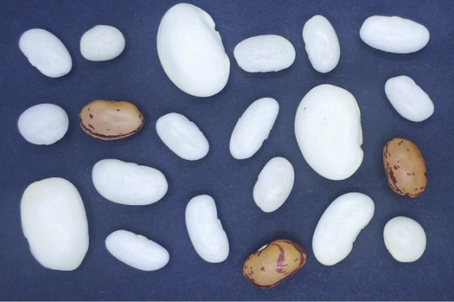
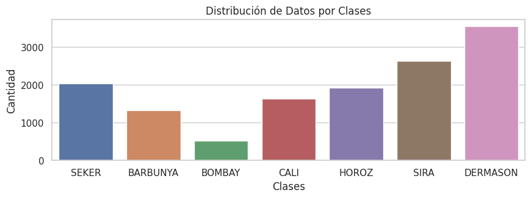
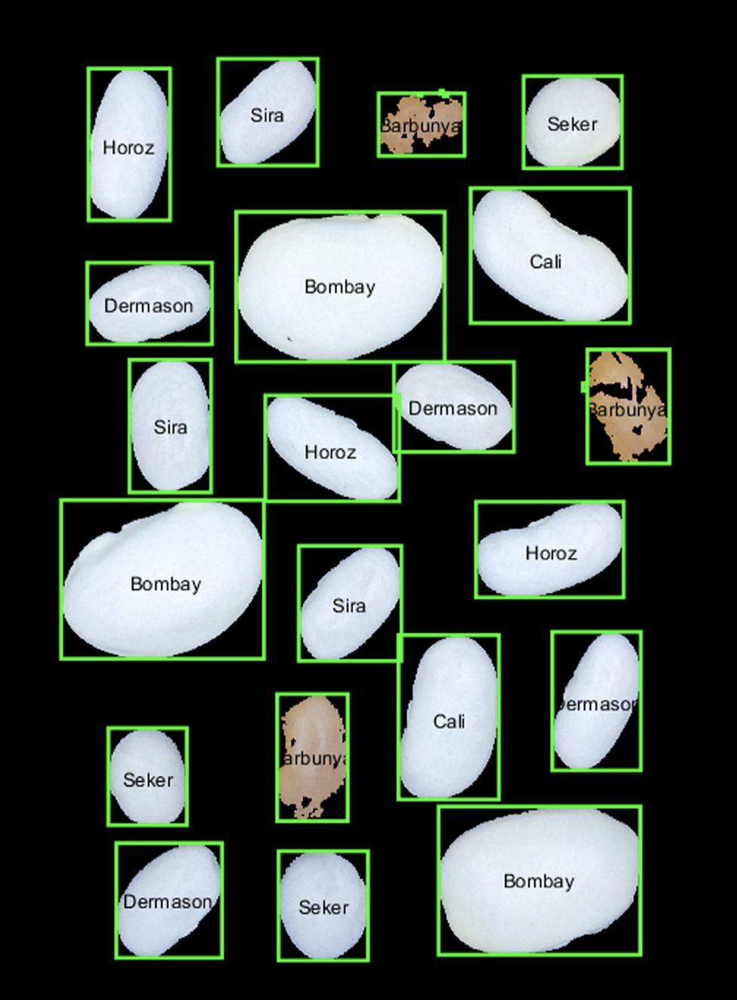
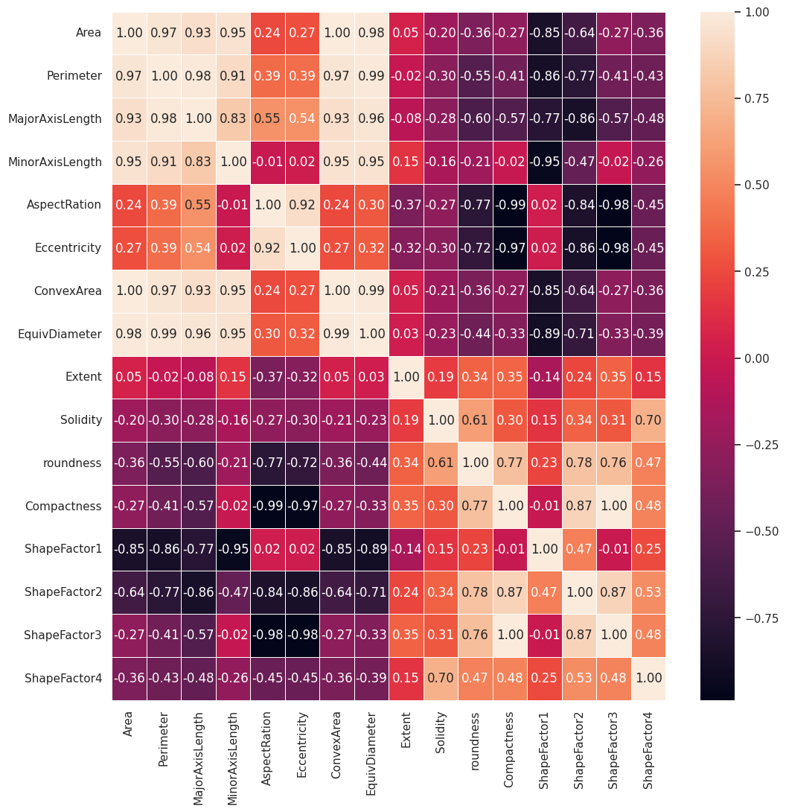
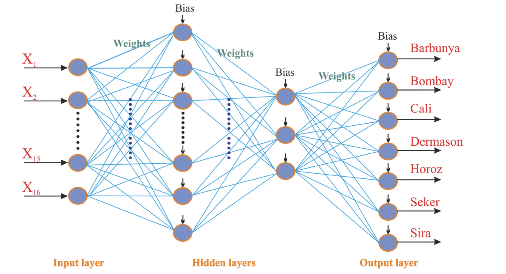
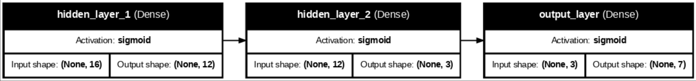
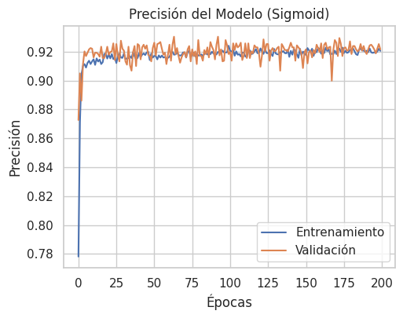
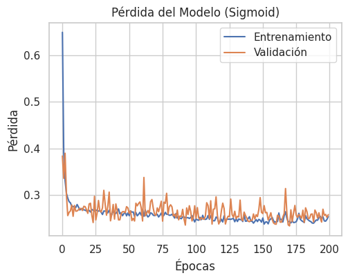
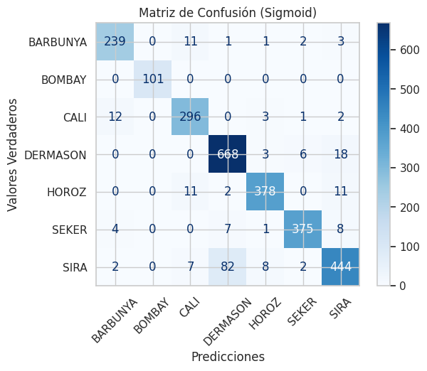
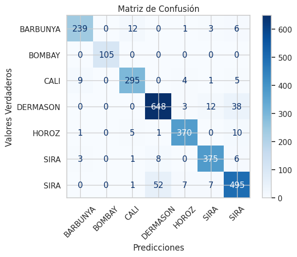

# Clasificación de Frijoles con un modelo entrenado

Miguel Angel Uribe Esquivel     A01277614

## Introducción
Los frijoles secos pertenecen a una extensa familia de leguminosas, la cual se considera que es la más producida a nivel mundial. Originarios de América, estos frijoles se han distribuido ampliamente por casi todas las regiones del mundo, propagando múltiples especies a nivel global y generando nuevas variantes a medida que las semillas se seleccionan según las características óptimas para su cultivo. El principal desafío que enfrentan los agricultores no reside únicamente en el cuidado de la vida de la planta, sino en la clasificación posterior a la cosecha. El proceso manual de clasificación de las semillas de frijol representa una tarea considerablemente compleja y prolongada, lo que puede dificultar la identificación de semillas aptas para ser enviadas a las huertas o comercializadas. 

Bajo este concepto, el objetivo de este proyecto será el de **desarrollar un modelo que logre clasificar de manera efectiva las siete variedades de frijol más comunes en la región de Turquía** basadas en sus características fisiológicas, como lo son su área, perimetro, consistencia, patrón, entre otros más.

### Descripción del Dataset
El conjunto de datos utilizado para este proyecto se obtuvo del UC Irvine Machine Learning Repository (https://archive.ics.uci.edu/dataset/602/dry+bean+dataset). Este conjunto de datos comprende de 13,611 instancias de datos recopiladas de las siete variedades de frijol seco más comunes en la región de Turquía, las cuales son: Seker, Barbunya, Bombay, Cali, Dermosan, Horoz y Sira. Cada instancia de frijol seco se caracteriza por 16 atributos, de los cuales 13 son de tipo flotante, 2 son de tipo entero y 1 es un object.

La información contenida en este conjunto de datos se derivó de un estudio fotográfico exhaustivo de miles de imágenes de las variedades de frijol antes mencionadas. Los datos de estas imágenes fueron digitalizados para extraer las siguientes características:

| **Característica** | **Tipo** | **Descripción**
|--------------------|----------|------------------
|Area (A)	         | Integer	| The area of a bean zone and the number of pixels within its boundaries
|Perimeter (P)	     | Float	| Bean circumference is defined as the length of its border.	
|MajorAxisLength (L) | Float	| The distance between the ends of the longest line that can be drawn from a bean		
|MinorAxisLength (l) | Float	| The longest line that can be drawn from the bean while standing perpendicular to the main axis		
|AspectRatio (K)	 | Float	| Defines the relationship between MajorAxisLength and MinorAxisLength		
|Eccentricity (Ec)	 | Float	| Eccentricity of the ellipse having the same moments as the region		
|ConvexArea (C)	     | Integer	| Number of pixels in the smallest convex polygon that can contain the area of a bean seed	
|EquivDiameter (Ed)	 | Float	| Equivalent diameter: The diameter of a circle having the same area as a bean seed area		
|Extent (Ex)         | Float	| The ratio of the pixels in the bounding box to the bean area		
|Solidity (S)    	 | Float	| Also known as convexity. The ratio of the pixels in the convex shell to those found in beans.		
|Roundness (R)	     | Float    | Calculated with the following formula: (4piA)/(P^2)		
|Compactness (Co)	 | Float    | Measures the roundness of an object	
|ShapeFactor1		 | Float	| L/A	
|ShapeFactor2		 | Float	| l/A	
|ShapeFactor3		 | Float	| A/((L/2)*(L/2)*pi)
|ShapeFactor4		 | Float    | A/((L/2)*(l/2)*pi)
|Class               | Object   | Dry-bean species

<p align="center">
  
  <br>
  <em>Imagen 1. Tipo de frijoles secos presentes en el dataset</em>
</p>

## Metodología

### Preprocesamiento

El conjunto de datos consta de 13,611 instancias y 16 columnas. De estas 16 columnas, 15 representan las características físicas de los frijoles, previamente descritas.  De las 15 columnas numéricas, 13 son de tipo `float` y 2 son de tipo `integer`. La variable de tipo `object` corresponde a la clase de frijol seco a la que pertenece cada instancia, la cual será utilizada como variable categórica.

De los 13,611 registros que componen el dataset, se encontraron 68 items duplicados.
<p align="center">
  
  <br>
  <em>Fragmento de ejecución del código</em>
</p>


La distribucion de los datos despues del borrado de duplicados se encuentra de la siguiente forma por clase:
- Seker: 2027
- Barbunya: 1322
- Bombay: 522
- Cali: 1630
- Horoz: 1860
- Sira: 2636
- Dermason: 3546

<p align="center">
  
  <br>
  <em>Gráfico 1. Distribución de datos por clases</em>
</p>

Se observa un desbalance significativo en la distribución de datos entre las distintas clases. No obstante, no considero que este desbalance impacte considerablemente al rendimiento del modelo. Por ejemplo, la variedad de frijol con menor cantidad de datos es la Bombay, la cual, paradójicamente, es la más notablemente grande en comparación con las demás especies. La siguiente variedad con menos datos es la Barbunya, la cual presenta patrones de manchas en la superficie de su grano, lo que facilita su diferenciación del resto, que son completamente lisos y blancos.  Asimismo, es razonable que exista una mayor cantidad de datos para las variedades Sira y Dermason, dado que ambas presentan similitudes físicas considerables con diferencias sutiles; por consiguiente, se requiere una mayor cantidad de datos para estas dos variedades con el fin de que el modelo pueda diferenciarlas con precisión.

<p align="center">
  
  <br>
  <em>Imagen 2. Diferencias morfológicas por especie</em>
</p>

#### Mapa de correlación

Para este conjunto de datos, se utilizó un mapa de calor con el fin de identificar la dependencia y correlación entre las variables. El gráfico revela una alta correlación entre las primeras variables de dimensiones, correspondientes al área, perímetro, eje longitudinal mayor y eje longitudinal menor. Esta alta dependencia mutua es razonable, dado que los ejes longitudinales dependen en gran medida del perímetro del frijol, y matemáticamente, el área del frijol también depende de su perímetro.  Asimismo, existe una relación con otras variables de medición similares, como el área convexa y el diámetro equivalente, así como los factores de forma, que comparten cálculos similares. A pesar de la presencia de múltiples variables redundantes, cada una cumple un propósito en el cálculo longitudinal de los frijoles. Por lo tanto, la eliminación de alguna de estas variables podría sesgar los datos de diferencia entre especies similares. En consecuencia, se han conservado todas las variables para el entrenamiento del modelo.

<p align="center">
  
  <br>
  <em>Gráfico 2. Mapa de calor de correlación</em>
</p>

### Separación de los datos
#### Datasplit
Para el datasplit se escogio un porcentaje de 80% de los datos dedicados al training del modelo y el 20% restante dedicado para el test del modelo. Dentro del 80% de train, seran untilizados un 20% para la validación del entrenamiento en ejecución.

#### One-hot encoding y Scaler
Como se mencionó anteriormente, el conjunto de datos contiene múltiples campos numéricos con rangos numéricos considerablemente elevados y diversos entre sí. Esta variabilidad puede impactar negativamente el proceso de entrenamiento del modelo, ya que los rangos desproporcionados de valores introducen ruido y confusión, lo que resulta en que los números pequeños pierdan prioridad durante la evaluación frente a los números grandes. Al escalar los datos entre -1 y 1, se obliga a la red neuronal a considerar todas las características con la misma importancia y peso. Para ello se uso la siguiente función:
`scaler = StandardScaler()`

La columna que asigna la variedad del frijol a cada instancia del conjunto de datos es la columna ‘Class’, la cual se caracteriza por contener valores de tipo `String`.  Dado que un modelo MLP no puede interpretar cadenas de caracteres, se implementa un One-hot encoding para traducir dichas cadenas de manera numérica.  Este proceso transforma los datos en columnas de 0 y 1, donde la posición que contiene el 1 indica la variedad de frijol correspondiente a esa instancia. Esto se realiza con la funcion OneHotEncoder() en las columnas class de los datos de train y test:

```
encoder = OneHotEncoder(sparse_output=False)
y_train_encoded = encoder.fit_transform(y_train.reshape(-1, 1))
y_test_encoded = encoder.transform(y_test.reshape(-1, 1))
```
### Métricas de evaluación
Para poder evaluar los resultados de los diferentes modelos, se optó por seguir las mismas metricas usadas en los papers que inspiraron a estre proyecto. Tanto la evaluación inicial realizada por Murat Koklu e Ilker Ali Ozkan en 2020, como la evaluación siguiente de Koeshardianto M., Permana K.E., Satria D. y Setiawan W. usaron las siguientes metricas:

| **Metrica** | **Descripción** 
|-------------|----------
|**Accuracy** | Mide el porcentaje total de aciertos del modelo.
|**Loss**     | Mide que tan equivocadas estan las prediciones del modelo contra las respuestas reales.
|**Recall**   | Mide la capacidad del modelo para encontrar los miembros de cada clase.
|**F1-Score** | Es el promedio armonico entre la Precisión y Recall.

### Modelo
Para este proyecto, se evaluaran tres tipos de modelos; los primeros dos modelos seran MLP (Multi Layer Perceptron), mientras que el tercer modelo sera un Random Forest (Conjunto de Árboles de Decisión). Se compararán los resultados de los modelos y se analizarán sus respectivos resultados.

<p align="center">
  
  <br>
  <em>Imagen 3. Arquitectura de los modelos MLP</em>
</p>

#### Primera Iteración: Modelo V1. Sigmoid
Para la primera version de mi modelo, me base en la que fue construida originalmente para la solucion de este problema, realizado por Murat Koklu e Ilker Ali Ozkan (2020). 
En esta primera versión, la arquitectura del modelo comienza con una capa de entrada ajustada dinámicamente al número de características de los datos. A esta le siguen dos capas ocultas densas: la primera con 12 neuronas y la segunda con 3 neuronas, utilizando ambas la función de activación sigmoide. Finalmente, la capa de salida se adapta al número de categorías y emplea también una activación sigmoide. 
```
modelSig = keras.Sequential([
    layers.Input(shape=(x_train_scaled.shape[1],)),
    layers.Dense(12, activation='sigmoid', name='hidden_layer_1'),
    layers.Dense(3, activation='sigmoid', name='hidden_layer_2'),
    layers.Dense(y_train_encoded.shape[1], activation='sigmoid', name='output_layer')
])

optimizer_adam = keras.optimizers.Adam(learning_rate=0.3)
```
Todo esto resumido en la siguiente imagen:

<p align="center">
  
  <br>
  <em>Imagen 4. Arquitectura del modelo Sigmoid</em>
</p>


Para el proceso de entrenamiento, el modelo se compila utilizando el optimizador Adam con una tasa de aprendizaje de 0.3, un valor. Al tratarse de una clasificación con varias clases, se utiliza la función de pérdida categorical_crossentropy. El entrenamiento consta de 200 épocas con un batch_size de 8 items.
```
historySig = modelSig.fit(
    x_train_scaled, y_train_encoded,
    epochs=200,
    batch_size=8,
    validation_split=0.2,
)
```

Resumen del modelo:
|**Hiperparametros**| **Parametro**
|-----|----
| Capas ocultas                         | 2
| Función de activación (capas ocultas) | Sigmoid
| Función de activación (output)        | Sigmoid
| Función de perdida (Loss)             | categorical_crossentropy
| Optimizador                           | Adam
| Learning Rate                         | 0.3
| Número de Épocas                      | 200
| Batch size                            | 3

##### Resultados
<p align="center">
  <label style="display: inline-block;">
    
    
  </label>
  <br>
  <label style="display: inline-block;">
  <em>Grafico 3. Accuracy del modelo Sigmoid    |    Grafico 4. Loss del modelo Sigmoid</em>
  </label>
</p>

#### Modelo V2. Relu y Softmax
Para la segunda versión de mi modelo, quise cambiar algunos parámetros de la versión original consolidada. La arquitectura sigue siendo consolidada por la capa de entrada igual al número de características del conjunto de datos, posteriormente de dos capas densas de (12 y 3 neuronas respectivamente) pero con el cambio de usar `relu` como función de activación para introducir no linealidad al modelo. Por último, la capa de salida fue cambiada para usar `softmax` en vez de `sigmoid` para poder calcular el porcentaje de pretenencia a la clase en vez de ser arbitrariamente binario para las 7 clases que existen.

### Resultados
#### Mapa de confusión Modelo Sigmoid
<p align="center">
  
  <br>
  <em>Gráfico 3. Mapa de confusión del modelo sigmoid</em>
</p>

#### Mapa de confusión Modelo Relu/Softmax
<p align="center">
  
  <br>
  <em>Gráfico 4. Mapa de confusión del modelo relu/softmax</em>
</p>

## Referencias
Koklu M., Ozhan I. (2020). Multiclass classi cation of dry beans using computer vision and machine
learning techniques. Computers and Electronics in Agriculture. https://www.sciencedirect.com/science/article/pii/S0168169919311573?via%3Dihub 

Koeshardianto M., Permana K.E., Satria D., Setiawan W. (2023). Beans classification using decision tree and random forest with randomized search hyperparameter tuning. https://scik.org/index.php/cmbn/article/view/8225 